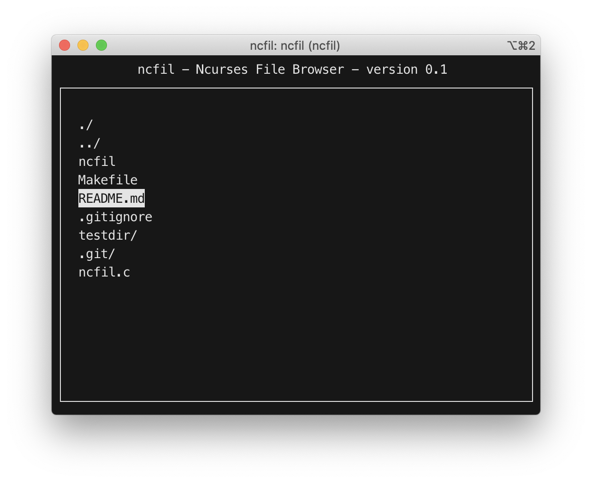

# ncfil
A basic file browser using Ncurses

## Usage
Running 'ncfil' will output the relative filepath to the chosen file through stdout. The idea is for it to be used in conjunction with another command.
<br />

```
vim `ncfil`
```
This will open ncfil and then open the chosen file in vim.
## Keybindings
- J- Move down
- K - Move up
- T - Move to top of list
- B - Move to bottom of list
- Q - Quit
- ENTER - Select file/Go into directory
